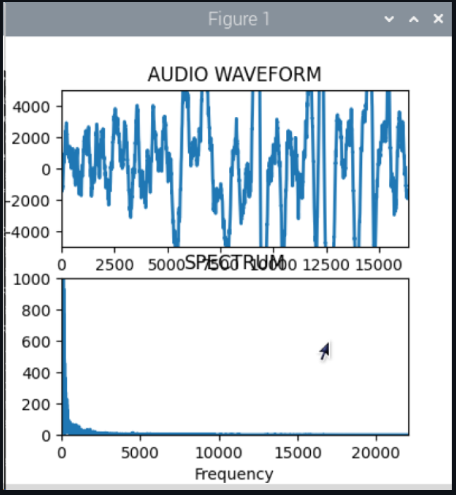
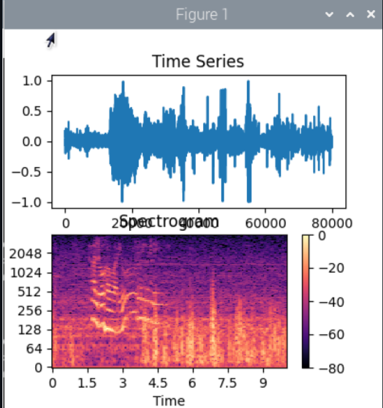
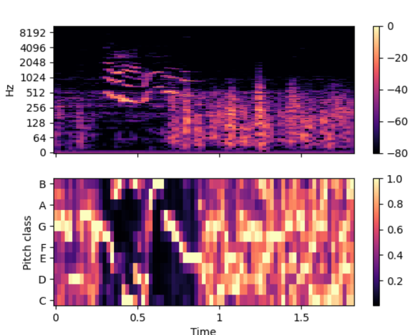
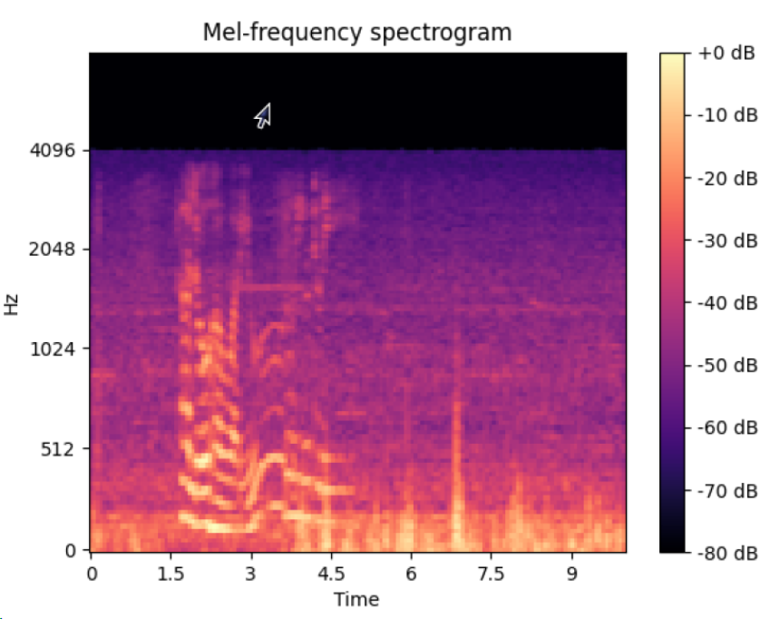
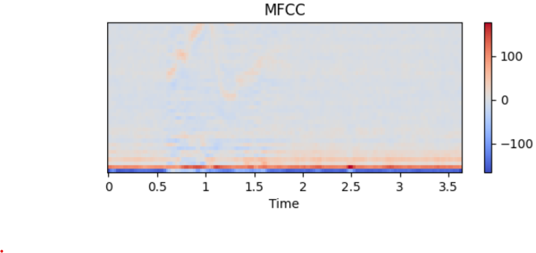
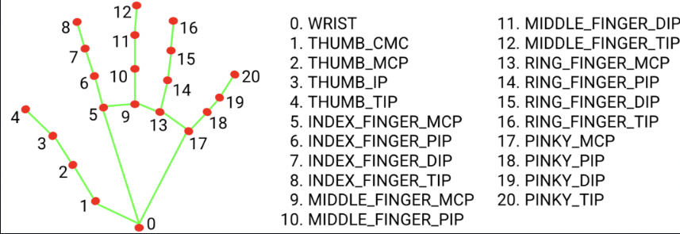

# Week 1
## capimg.py
```python
import cv2

# Initialize the webcam
cap = cv2.VideoCapture(0)

# Check if the webcam is opened correctly
if not cap.isOpened():
    raise IOError("Cannot open webcam")

# Capture one frame (like taking a screenshot)
ret, frame = cap.read()

# Save the captured image
cv2.imwrite('captured_image.jpg', frame)

# Release the webcam
cap.release()

print("Image captured and saved!")
```

## capvid.py
```python
import cv2
import numpy as np

# Initialize the webcam
cap = cv2.VideoCapture(0)

# Read the first frame
"""
cap.read() returns 2 values:
1. A boolean indicating if the frame was successfully captured (True if successful, False otherwise).
2. The actual frame captured by the camera (as an image array).

_ is used to ignore the boolean since we dont need it
"""
_, frame1 = cap.read()
_, frame2 = cap.read()


while True:
    # Calculate the absolute difference between frames

# diff = cv2.absdiff(frame1, frame2)
"""
This calculates the absolute difference between two frames (frame1 and frame2).

highlights any changes or movement between the two frames, producing a "difference image" where moving objects will appear as bright areas.
"""
    diff = cv2.absdiff(frame1, frame2)


# gray = cv2.cvtColor(diff, cv2.COLOR_BGR2GRAY)
"""
This converts the diff from color to grayscale. each pixel represents intensity (brightness)

- simplifies further processing by reducing the image's complexity
- easier to process
"""
    gray = cv2.cvtColor(diff, cv2.COLOR_BGR2GRAY)


# blur = cv2.GaussianBlur(gray, (5, 5), 0)
"""
This applies a Gaussian blur to image
smooth out noise and small variations. 

helps make the motion detection process more robust by reducing false positives

removes tiny, unimportant changes
"""
    blur = cv2.GaussianBlur(gray, (5, 5), 0)


# Thresholding: _, thresh = cv2.threshold(blur, 20, 255, cv2.THRESH_BINARY)
"""
converts the grayscale blurred image (blur) into a binary image.

How it works: 
The cv2.threshold function checks each pixel in the image:
If the pixel intensity is greater than 20, it turns the pixel white (255).
If the pixel intensity is less than or equal to 20, it turns the pixel black (0).


helps simplify the image further

cv2.threshold also returns 2 values: 
1. A ret value, which is the threshold that was used.
2. The thresh image, which is the result of the thresholding operation.

we dont need the first value
"""
    _, thresh = cv2.threshold(blur, 20, 255, cv2.THRESH_BINARY)


# Dilation: dilated = cv2.dilate(thresh, None, iterations=3)
"""
This enlarges the white regions in the binary image.

How it works: 
 "expands" the white areas (where motion was detected) to make the detected moving objects more visible

Why it's needed: helps connect broken parts of objects that are detected as separate regions
"""
    dilated = cv2.dilate(thresh, None, iterations=3)


#  Finding Contours: contours, _ = cv2.findContours(dilated, cv2.RETR_TREE, cv2.CHAIN_APPROX_SIMPLE)
 """
Purpose: This finds the boundaries of the white regions (moving objects) in the dilated binary image.

How it works:
- looks for continuous boundaries (contours) in the binary image. 
- detects the outer edges of the moving objects and creates a list of contours.

Why it's needed: to draw rectangles around the detected motion areas
"""
    contours, _ = cv2.findContours(dilated, cv2.RETR_TREE, cv2.CHAIN_APPROX_SIMPLE)

    # Draw rectangles around detected contours
    for contour in contours:
        (x, y, w, h) = cv2.boundingRect(contour)

        if cv2.contourArea(contour) < 900:
            continue
        cv2.rectangle(frame1, (x, y), (x+w, y+h), (0, 255, 0), 2)
        cv2.putText(frame1, "Status: {}".format('Movement'), (10, 20), cv2.FONT_HERSHEY_SIMPLEX,
                    1, (0, 0, 255), 3)

    cv2.imshow("feed", frame1)
    frame1 = frame2
    _, frame2 = cap.read()

    # Break the loop if 'q' is pressed
    if cv2.waitKey(40) == ord('q'):
        break

cap.release()
cv2.destroyAllWindows()

```

## Questions to think about
- [x] Identify and explain the additional functionalities introduced in Code #2. How do these changes transform the program from a simple image capture to a movement detection system?
- [x] Several new OpenCV functions are used (like cv2.absdiff, cv2.cvtColor, cv2.GaussianBlur, cv2.threshold, cv2.dilate, and cv2.findContours). Research each of these functions and understand their role in processing the video frames for movement detection.
- [ ] The program uses specific conditions (such as contour area) to decide when to draw rectangles and indicate movement. Experiment with these parameters to see how they affect the accuracy and sensitivity of movement detection.
- [x] Loop Mechanics and Video Processing: Analyze the role of the while loop in the 2nd Code for continuous video capture and processing. How does this looping mechanism differ from the single capture approach in the 1st Code, especially in terms of real-time processing and movement detection?
- [ ] Consider aspects like improving the accuracy of movement detection, optimizing performance, or adding new features (like recording video when movement is detected).

<br/>
<br/>
<br/>
<br/>
<br/>

# Week 2
## week2_microphone_streaming_with_spectrum_pyaudio.py
```python
import pyaudio # interface microphone and capture audio in real time
import struct  # Used for converting raw audio  to bytes to integer 16 bits
import numpy as np 
import matplotlib.pyplot as plt
from scipy.fftpack import fft, fftfreq # fft - fast fourier transfor, compute frequency spectrum
import time # In case time of execution is required

#%% Parameters
BUFFER = 1024 * 16           # number of audio sample to capture in each frame. 15384 samples
FORMAT = pyaudio.paInt16     # audio format (bytes per sample)
CHANNELS = 1                 # number of audio channels, 1 means mono
RATE = 44100                 # samples per second
RECORD_SECONDS = 30          # Specify the time to record from the microphone in seconds

#%% create matplotlib figure and axes with initial random plots as placeholder
fig, (ax1, ax2) = plt.subplots(2, figsize=(7, 7))
# create a line object with random data
x = np.arange(0, 2*BUFFER, 2)       # samples (waveform)
xf = fftfreq(BUFFER, (1/RATE))[:BUFFER//2]

line, = ax1.plot(x,np.random.rand(BUFFER), '-', lw=2)
line_fft, = ax2.plot(xf,np.random.rand(BUFFER//2), '-', lw=2)

# basic formatting for the axes
ax1.set_title('AUDIO WAVEFORM')
ax1.set_xlabel('samples')
ax1.set_ylabel('volume')
ax1.set_ylim(-5000, 5000) # change this to see more amplitude values (when we speak)
ax1.set_xlim(0, BUFFER)

ax2.set_title('SPECTRUM')
ax2.set_xlabel('Frequency')
ax2.set_ylabel('Log Magnitude')
ax2.set_ylim(0, 1000) 
ax2.set_xlim(0, RATE/2)

# Do not show the plot yet
plt.show(block=False)


#%% Initialize the pyaudio class instance
audio = pyaudio.PyAudio() 
# stream object to get data from microphone


# starts an audio stream. set up micrphone and output
stream = audio.open(
    format=FORMAT,
    channels=CHANNELS,
    rate=RATE,
    input=True,
    output=True,
    frames_per_buffer=BUFFER
)

print('stream started')


exec_time = []
for _ in range(0, RATE // BUFFER * RECORD_SECONDS): # audio recording loop
       
    # binary data
    data = stream.read(BUFFER) # reads BUFFER number of samples from mic
   
    # convert data to 16bit integers
    data_int = struct.unpack(str(BUFFER) + 'h', data)    
    
    # compute FFT    
    start_time=time.time()  # for measuring frame rate

#fft(data_int)


"""
applies fft to audio data

- converts audio signal from time domain (waveform) to frequency domain (spectrum)

- tells you which frequencies are present in the audio signal and their magnitudes
"""
    yf = fft(data_int)
    


    # calculate time of execution of FFT
    exec_time.append(time.time() - start_time)
    
    #update line plots for both axes
    line.set_ydata(data_int)
    line_fft.set_ydata(2.0/BUFFER * np.abs(yf[0:BUFFER//2]))
    fig.canvas.draw()
    fig.canvas.flush_events()
    
audio.terminate()
   
print('stream stopped')
print('average execution time = {:.0f} milli seconds'.format(np.mean(exec_time)*1000))
```

## week2_microphone_streaming_with_spectrum_sounddevice.py
```python
#%% Import the required libraries
import sounddevice as sd # Refer to https://python-sounddevice.readthedocs.io/en/0.4.6/
import numpy as np 
import matplotlib.pyplot as plt
import time

#%% Parameters
BUFFER = 1024 * 16           # samples per frame (you can change the same to acquire more or less samples)
CHANNELS = 1                 # single channel for microphone
RATE = 44100                 # samples per second
RECORD_SECONDS = 30          # Specify the time to record from the microphone in seconds

#%% create matplotlib figure and axes with initial random plots as placeholder
fig, (ax1, ax2) = plt.subplots(2, figsize=(4, 4))
# create a line object with random data
x = np.arange(0, 2*BUFFER, 2)       # samples (waveform)
xf = np.fft.fftfreq(BUFFER,1/RATE)[:BUFFER//2]
line, = ax1.plot(x,np.random.rand(BUFFER), '-', lw=2)
line_fft, = ax2.plot(xf,np.random.rand(BUFFER//2), '-', lw=2)

# basic formatting for the axes
ax1.set_title('AUDIO WAVEFORM')
ax1.set_xlabel('samples')
ax1.set_ylabel('volume')
ax1.set_ylim(-5000, 5000) # change this to see more amplitude values (when we speak)
ax1.set_xlim(0, BUFFER)

ax2.set_title('SPECTRUM')
ax2.set_xlabel('Frequency')
ax2.set_ylabel('Log Magnitude')
ax2.set_ylim(0, 1000) 
ax2.set_xlim(0, RATE/2)

# Do not show the plot yet
plt.show(block=False)

#%% Reconrding the sound and constructing the spectrum
exec_time = []
for _ in range(0, RATE // BUFFER * RECORD_SECONDS):   
       
    # Record the sound in int16 format and wait till recording is done
    data = sd.rec(frames=BUFFER,samplerate=RATE,channels=CHANNELS,dtype='int16',blocking=True)
    data = np.squeeze(data)  
    
    # compute FFT    
    start_time=time.time()  # for measuring frame rate
    fft_data = np.fft.fft(data)
    fft_data = np.abs(fft_data[:BUFFER//2])
    
    # calculate time of execution of FFT
    exec_time.append(time.time() - start_time)
    
    #update line plots for both axes
    line.set_ydata(data)
    line_fft.set_ydata(fft_data)
    line_fft.set_ydata(2.0/BUFFER * fft_data)
    fig.canvas.draw()
    fig.canvas.flush_events()

  
print('stream stopped')
print('average execution time = {:.0f} milli seconds'.format(np.mean(exec_time)*1000))

```
## output


## week2_filtering_audio.py
```python
#%% Import the required libraries
import pyaudio # Refer to https://people.csail.mit.edu/hubert/pyaudio/
import struct  # Refer to https://docs.python.org/3/library/struct.html (Used for converting audio read as bytes to int16)
import numpy as np 
import matplotlib.pyplot as plt
from scipy.signal import butter, sosfilt # Refer to https://docs.scipy.org/doc/scipy/reference/signal.html (Used for Bandpass filtering)
import time # In case time of execution is required  

#%% Parameters
BUFFER = 1024 * 16          # samples per frame (you can change the same to acquire more or less samples)
FORMAT = pyaudio.paInt16    # audio format (bytes per sample)
CHANNELS = 1                # single channel for microphone
RATE = 44100                # samples per second
RECORD_SECONDS = 20         # Specify the time to record from the microphone in seconds

#%% create matplotlib figure and axes with initial random plots as placeholder
fig, (ax1, ax2) = plt.subplots(2, figsize=(7, 7))
# create a line object with random data
x = np.arange(0, 2*BUFFER, 2)       # samples (waveform)

line, = ax1.plot(x,np.random.rand(BUFFER), '-', lw=2)
line_filter, = ax2.plot(x,np.random.rand(BUFFER), '-', lw=2)

# basic formatting for the axes
ax1.set_title('AUDIO WAVEFORM')
ax1.set_xlabel('samples')
ax1.set_ylabel('amplitude')
ax1.set_ylim(-5000, 5000) # change this to see more amplitude values (when we speak)
ax1.set_xlim(0, BUFFER)

ax2.set_title('FILTERED')
ax2.set_xlabel('samples')
ax2.set_ylabel('amplitude')
ax2.set_ylim(-5000, 5000) 
ax2.set_xlim(0, BUFFER)

# show the plot
plt.show(block=False)

# bandpass filter (a filter that allows frequencies within a certain range and blocks others).
"""
[parameters]
lowfreq: The lower frequency of the filter.

highfreq: The higher frequency of the filter.

fs: The sample rate.

order: The order of the filter (3 is a common choice).


Converts the frequencies to a normalized scale by dividing by the Nyquist frequency (half of the sample rate).

butter creates a Butterworth filter with the specified parameters.

output='sos': This specifies that the filter should be returned as second-order sections (SOS), a numerically stable format for filtering.
"""
def design_filter(lowfreq, highfreq, fs, order=3):
    nyq = 0.5*fs
    low = lowfreq/nyq
    high = highfreq/nyq
    sos = butter(order, [low,high], btype='band',output='sos')
    return sos


# design the filter
"""
apply bandpass filter with the range 19,400 Hz to 19,600 Hz at a sample rate of 48,000 Hz.

This is useful if you want to isolate frequencies in a specific range, like a narrowband signal
"""
sos = design_filter(19400, 19600, 48000, 3) #change the lower and higher freqcies according to choice


#%% Initialize the pyaudio class instance
audio = pyaudio.PyAudio()

# stream object to get data from microphone
stream = audio.open(
    format=FORMAT,
    channels=CHANNELS,
    rate=RATE,
    input=True,
    output=True,
    frames_per_buffer=BUFFER
)

print('stream started')
exec_time = []
for _ in range(0, RATE // BUFFER * RECORD_SECONDS):   
       
    # binary data
    data = stream.read(BUFFER)  
   
    # convert data to 16bit integers
    data_int = struct.unpack(str(BUFFER) + 'h', data)    
    
    # Bandpass filtering
    start_time=time.time()  # for measuring frame rate
    yf = sosfilt(sos, data_int) #  Applies the previously designed bandpass filter (sos) to the audio data (data_int). This removes all frequencies outside the 19,400 to 19,600 Hz range.
    
    # calculate average frame rate
    exec_time.append(time.time() - start_time)
    
    #update line plots for both axes
    line.set_ydata(data_int)
    line_filter.set_ydata(yf)
    fig.canvas.draw()
    fig.canvas.flush_events()
    
audio.terminate()

print('stream stopped')
print('average execution time = {:.0f} milli seconds'.format(np.mean(exec_time)*1000))

```

## week2_audio_features.py
Spectrogram:

- a visual representation of the spectrum of frequencies of a signal as it varies with time.

- shows how the frequencies in an audio signal change over time.

- The code uses Short-Time Fourier Transform (STFT) to compute the spectrogram. It visualizes the magnitude and phase of the frequencies present in the audio.



Chromogram:

- represents the 12 different pitch classes (i.e., the notes in a musical scale) over time.

- The code computes the chromogram using the STFT of the audio, then visualizes it.



Mel-Spectrogram:

- a spectrogram that uses a Mel scale for frequency bins, which approximates how humans perceive frequencies.
- The code computes the Mel-Spectrogram using `librosa.feature.melspectrogram`.



MFCC (Mel-Frequency Cepstral Coefficients):

- features derived from the Mel-Spectrogram 
- represent the short-term power spectrum of sound
- The code computes the MFCCs using `librosa.feature.mfcc`



```python
#%% Import the required libraries

import numpy as np
import matplotlib.pyplot as plt

import librosa # Used for speech feature extraction: https://librosa.org/doc/

y, sr = librosa.load("test.wav", sr=None) #Save the microphone recording as test.wav 


# spectogram
"""
librosa.stft(y)
- Computes the Short-Time Fourier Transform (STFT) of the audio signal. 
- STFT breaks the audio into small chunks and computes the frequencies in each chunk.
"""
S_full, phase = librosa.magphase(librosa.stft(y))

#%% Plot the time series and the frequency-time plot (spectrogram)
fig, (ax1, ax2) = plt.subplots(2, figsize=(7, 7))
ax1.plot(y)
ax1.set_xlabel('samples')
ax1.set_ylabel('volume')
img = librosa.display.specshow(librosa.amplitude_to_db(S_full, ref=np.max),
                          y_axis='log', x_axis='time', sr=sr, ax=ax2)
fig.colorbar(img, ax=ax2)
ax1.set(title='Time Series')
ax2.set(title='Spectrogram')
plt.show()


# 2. Chromagram
"""
- computed from the STFT of the audio signal 
- represents the energy content in each of the 12 pitch classes.
"""
S = np.abs(librosa.stft(y, n_fft=4096))**2
chroma = librosa.feature.chroma_stft(S=S, sr=sr)
fig, ax = plt.subplots(nrows=2, sharex=True)
img = librosa.display.specshow(librosa.amplitude_to_db(S, ref=np.max),
                               y_axis='log', x_axis='time', ax=ax[0])
fig.colorbar(img, ax=[ax[0]])
ax[0].label_outer()
img = librosa.display.specshow(chroma, y_axis='chroma', x_axis='time', ax=ax[1])
fig.colorbar(img, ax=[ax[1]])
ax1.set(title='Power Spectrogram')
ax2.set(title='Chromogram')
plt.show()


# 3. Mel-Spectrogram
"""
- uses the Mel scale (a scale based on human auditory perception) to represent frequencies. 
- computed with librosa.feature.melspectrogram 
- has the frequency range limited to 8000 Hz (fmax=8000).
"""
S_mel = librosa.feature.melspectrogram(y=y, sr=sr, n_mels=128,
                                    fmax=8000)
fig, ax = plt.subplots()
S_mel_dB = librosa.power_to_db(S_mel, ref=np.max)
img = librosa.display.specshow(S_mel_dB, x_axis='time',
                         y_axis='mel', sr=sr,
                         fmax=8000, ax=ax)
fig.colorbar(img, ax=ax, format='%+2.0f dB')
ax.set(title='Mel-frequency spectrogram')
plt.show()


# MFCC
"""
- computed from mel spectogram
- the coefficients are compact representation of audio signal spectral shape
- captures the most important characteristics for tasks like speech recognition
"""
mfccs = librosa.feature.mfcc(y=y, sr=sr, n_mfcc=40)
S = librosa.feature.melspectrogram(y=y, sr=sr, n_mels=128,
                                   fmax=8000)
fig, ax = plt.subplots(nrows=2, sharex=True)
img = librosa.display.specshow(librosa.power_to_db(S, ref=np.max),
                               x_axis='time', y_axis='mel', fmax=8000,
                               ax=ax[0])
fig.colorbar(img, ax=[ax[0]])
ax[0].set(title='Mel spectrogram')
ax[0].label_outer()
img = librosa.display.specshow(mfccs, x_axis='time', ax=ax[1])
fig.colorbar(img, ax=[ax[1]])
ax[1].set(title='MFCC')
plt.show()

```

## week2_microphone_recognition.py
```python
#!/usr/bin/env python3
# Refer to https://github.com/Uberi/speech_recognition?tab=readme-ov-file#readme
# Demo for speech recognition. You need to speak only after it says Say something
#%% import all necessary libraries
import speech_recognition as sr
import time
import os

#%% Recording from microphone
# obtain audio from the microphone
r = sr.Recognizer() #Initializing the Recognizer class
with sr.Microphone() as source:
    r.adjust_for_ambient_noise(source) #Important step to identify the ambient noise and hence be silent during this phase
    os.system('clear') 
    print("Say something!")
    audio = r.listen(source) # Listening from microphone

# recognize speech using Google Speech Recognition
start_time=time.time()  # start time
try:
    # for testing purposes, we're just using the default API key
    # to use another API key, use `r.recognize_google(audio, key="GOOGLE_SPEECH_RECOGNITION_API_KEY")`
    # instead of `r.recognize_google(audio)`
    print("Google Speech Recognition thinks you said " + r.recognize_google(audio))
except sr.UnknownValueError:
    print("Google Speech Recognition could not understand audio")
except sr.RequestError as e:
    print("Could not request results from Google Speech Recognition service; {0}".format(e))
print('Time for Google Speech Recognition recognition = {:.0f} seconds'.format(time.time()-start_time))

# recognize speech using Sphinx
start_time=time.time()  # start time
try:
     print("Sphinx thinks you said " + r.recognize_sphinx(audio))    
except sr.UnknownValueError:
    print("Sphinx could not understand audio")
except sr.RequestError as e:
    print("Sphinx error; {0}".format(e))
print('Time for Sphinx recognition = {:.0f} seconds'.format(time.time()-start_time))


```


<br/>
<br/>
<br/>
<br/>
<br/>


# Week 3
## week3_image_capture_display.py
```python
# Reference: https://pyimagesearch.com/2014/08/04/opencv-python-color-detection/
import cv2
import numpy as np

# Defining a list of boundaries in the RGB color space 
# (or rather, BGR, since OpenCV represents images as NumPy arrays in reverse order) 
# These are the lower and upper color boundaries in BGR format (note that OpenCV uses BGR, not RGB).
boundaries = [
	([17, 15, 100], [50, 56, 200]), # For Red
	([86, 31, 4], [220, 88, 50]), # For Blue
	([25, 90, 4], [62, 200, 50])] # For Green 


# Normalize the Image for display (Optional)
# rescales pixel values to a 0–255 range
def normalizeImg (Img):
    Img= np.float64(Img) #Converting to float to avoid errors due to division
    norm_img = (Img - np.min(Img))/(np.max(Img) - np.min(Img))
    norm_img = np.uint8(norm_img*255.0)
    return norm_img


#%% Open CV Video Capture and frame analysis
cap = cv2.VideoCapture(0)

# Check if the webcam is opened correctly
if not cap.isOpened():
    raise IOError("Cannot open webcam")

# The loop will break on pressing the 'q' key
while True:
    try:
        # Capture one frame
        ret, frame = cap.read()    
        
        output=[]
        
        # loop over the boundaries       
        for (lower, upper) in boundaries:
        	# create NumPy arrays from the boundaries
        	lower = np.array(lower, dtype = "uint8")
        	upper = np.array(upper, dtype = "uint8")
        	
            # find the colors within the specified boundaries and apply the mask (basically segmenting for colours)


"""
cv2.inRange(frame, lower, upper):
- produces a binary mask where white pixels (255) represent areas of the image within the color range, and black pixels (0) represent everything else.
"""
        	mask = cv2.inRange(frame, lower, upper)


"""
cv2.bitwise_and(frame, frame, mask=mask):
- applies that mask to the original frame, creating a “segmented” image that highlights only the target color.
"""
        	output.append(cv2.bitwise_and(frame, frame, mask = mask)) #Segmented frames are appended


        
        # Output is appeneded to be of size Pixels X 3 (for R, G, B)
        red_img = normalizeImg(output[0])
        green_img = normalizeImg(output[1])
        blue_img = normalizeImg(output[2])
       
        # horizontal Concatination for displaying the images and colour segmentations
        catImg = cv2.hconcat([frame,red_img,green_img,blue_img])
        cv2.imshow("Images with Colours",catImg)
        
        if cv2.waitKey(1) & 0xFF == ord('q'):
           break
   
    except KeyboardInterrupt:
        break

cap.release()
cv2.destroyAllWindows()

```

## method 1 using scikit: week3_image_hog_feature.py
- The HoG (Histogram of Oriented Gradients) is a feature descriptor commonly used in computer vision for object detection and recognition.

- show how HoG transforms an image and highlight the differences between the raw image and its HoG feature representation.

- HoG helps capture edge information, which can be used to detect shapes, structures, and objects.

- especially useful for detecting objects in images or video streams by highlighting the texture and shape information in the image, which is crucial for tasks like human detection or vehicle recognition.
```python
"""
skimage.feature: This provides the HoG feature extraction function used later in the code.

skimage.exposure: This is used to adjust or normalize the intensity values of the HoG image.
"""
import cv2
import numpy as np
from skimage import feature # Refer to https://scikit-image.org/ for full capabalities of scikit-image library
from skimage import exposure


#%% Open CV Video Capture and frame analysis
cap = cv2.VideoCapture(0)

# Check if the webcam is opened correctly
if not cap.isOpened():
    raise IOError("Cannot open webcam")

# The loop will break on pressing the 'q' key
while True:
    try:
        # Capture one frame
        ret, frame = cap.read()  
        
        # resizing for faster detection
        #frame = cv2.resize(frame, (256, 256)) #Uncomment and see the speed up
        


        # Converting to gray scal as HOG feature extraction in scikit-image works only on gray scale image
        #  HoG feature extraction works only on grayscale images.
        image = cv2.cvtColor(frame, cv2.COLOR_BGR2GRAY)
        


        # Extact the HoG featues from the grayscale image
"""
orientations=9:  defines the number of gradient directions to use (9 bins).

pixels_per_cell=(8, 8): The size of each cell in pixels. The gradient is computed over small regions (cells) of this size.

cells_per_block=(2, 2): Defines the number of cells in each block. HoG uses blocks to normalize the gradient features.

transform_sqrt=True: Applies a square root transformation to the gradient magnitudes (helpful for normalizing and improving performance).

block_norm="L1": Normalizes the block descriptors using L1-norm.

visualize=True: This returns a visualization of the HoG features (the HoG image).
"""
        (H, hogImage) = feature.hog(image, orientations=9, pixels_per_cell=(8, 8),
    	cells_per_block=(2, 2), transform_sqrt=True, block_norm="L1",
    	visualize=True)
        


        # Rescale intensity to be within 0-255 (contrast stretching)
        hogImage = exposure.rescale_intensity(hogImage, out_range=(0, 255)) #Rescales the pixel values of the HoG image to the range of 0 to 255 for better contrast and visibility.


        hogImage = hogImage.astype("uint8") #Converts the rescaled image to 8-bit unsigned integers for proper image display.


        
        # Converting gray to RGB
        hogImg = cv2.cvtColor(hogImage,cv2.COLOR_GRAY2RGB)
        
        # Horizontal concatenation to show both input image and its HoG features.
        catImg = cv2.hconcat([frame,hogImg])        
        cv2.imshow("HOG Image", catImg)
        
        if cv2.waitKey(1) & 0xFF == ord('q'):
           break
        
    except KeyboardInterrupt:
        break

cap.release()
cv2.destroyAllWindows()

```


## method2 using opencv week3_image_human_capture.py
```python
import cv2
import numpy as np

# initialize the HOG descriptor/person detector
hog = cv2.HOGDescriptor()
hog.setSVMDetector(cv2.HOGDescriptor_getDefaultPeopleDetector())

#sets how many pixels away from the center a person needs to be before the head stops
center_tolerance = 5; 

#%% Open CV Video Capture and frame analysis
cap = cv2.VideoCapture(0)

# Check if the webcam is opened correctly
if not cap.isOpened():
    raise IOError("Cannot open webcam")

# The loop will break on pressing the 'q' key
while True:
    try:
        # Capture one frame
        ret, frame = cap.read()  
        
        # resizing for faster detection
        frame = cv2.resize(frame, (256, 256)) #Uncomment and see the speed up
        
       # detect people in the image
        # returns the bounding boxes for the detected objects
        boxes, weights = hog.detectMultiScale(frame, winStride=(1,1), scale = 1.05)
        boxes = np.array([[x, y, x + w, y + h] for (x, y, w, h) in boxes])
        centers = []
        for box in boxes:
            #get the distance from the center of each box's center x cord to the center of the screen and ad them to a list
            center_x = ((box[2]-box[0])/2)+box[0]
            x_pos_rel_center = (center_x-70)
            dist_to_center_x = abs(x_pos_rel_center)
            centers.append({'box': box, 'x_pos_rel_center': x_pos_rel_center, 'dist_to_center_x':dist_to_center_x})    
        if len(centers) > 0:
               #sorts the list by distance_to_center
            sorted_boxes = sorted(centers, key=lambda i: i['dist_to_center_x'])
            #draws the box
            center_box = sorted_boxes[0]['box']
            for box in range(len(sorted_boxes)):
            # display the detected boxes in the colour picture
                if box == 0:
                    cv2.rectangle(frame, (sorted_boxes[box]['box'][0],sorted_boxes[box]['box'][1]), (sorted_boxes[box]['box'][2],sorted_boxes[box]['box'][3]), (0,255, 0), 2)
                else:
                    cv2.rectangle(frame, (sorted_boxes[box]['box'][0],sorted_boxes[box]['box'][1]), (sorted_boxes[box]['box'][2],sorted_boxes[box]['box'][3]),(0,0,255),2)
            #retrieves the distance from center from the list and determins if the head should turn left, right, or stay put and turn lights on
            Center_box_pos_x = sorted_boxes[0]['x_pos_rel_center']  
            if -center_tolerance <= Center_box_pos_x <= center_tolerance:
                #turn on eye light
                print("center")                
            elif Center_box_pos_x >= center_tolerance:
                #turn head to the right
                print("right")                
            elif Center_box_pos_x <= -center_tolerance:
                #turn head to the left
                print("left")               
            print(str(Center_box_pos_x))
        else:
            #prints out that no person has been detected            
            print("nothing detected")
        #resizes the video so its easier to see on the screen
        frame = cv2.resize(frame,(720,720))
        # Display the resulting frame
        cv2.imshow("frame",frame)       
        
        if cv2.waitKey(1) & 0xFF == ord('q'):
           break
        
    except KeyboardInterrupt:
        break

cap.release()
cv2.destroyAllWindows()

```

## compare method 1 and method 2
**HoG for People Detection vs. HoG for Feature Visualization**

In method 2 opencv:
```
# initialize the HOG descriptor/person detector
hog = cv2.HOGDescriptor()
hog.setSVMDetector(cv2.HOGDescriptor_getDefaultPeopleDetector())
```
- this code is using HoG specifically for detecting people in the webcam frames.
- uses the HoG descriptor with a pre-trained Support Vector Machine (SVM) detector for people detection.
- `hog.detectMultiScale()` method detects people in the image and returns the bounding boxes around detected individuals.
- After detecting people, the code calculates how far the detected person is from the center of the frame, and based on the person's position, it prints messages like "center", "right", or "left"
- typically used for applications like tracking or controlling a system (e.g., tracking a person’s head position).


In method 1 scikit:
```
(H, hogImage) = feature.hog(image, orientations=9, pixels_per_cell=(8, 8),
                             cells_per_block=(2, 2), transform_sqrt=True, block_norm="L1",
                             visualize=True)
```
- using HoG to visualize the features of the frame, not for detection.
- code extracts the HoG features (i.e., gradient information) from the image and visualizes the gradient information in the form of an image (hogImage)
- concatenates the original image and the HoG visualization side-by-side for visual inspection, but no people detection or action is performed in this code.


### Comparing method 1 and 2

People Detection vs. Feature Extraction

Method 2 (People Detection):

Detecting people: The primary task in this code is to detect people in the frame using HoG, which is part of a broader object detection task.

Bounding Boxes: After detecting the people, it draws bounding boxes around the detected person and calculates the relative position of the person to the center of the frame (for tracking and head movement actions).

Method 1 (Feature Extraction and Visualization):

Extracting Features: The code focuses on extracting HoG features from the image, which captures the orientation and magnitude of gradients in local regions of the image. This is a common method for feature extraction in image recognition and object detection tasks.

No Detection or Tracking: The second code does not perform any object detection or track people. It is purely for visualizing the HoG features in a side-by-side manner with the original image.

---
<br/>
<br/>

## week3_image_face_capture.py
```python
import cv2
import mediapipe as mp


# Initialize Mediapipe Face Mesh
"""
mp.solutions.face_mesh: 
- This accesses the Face Mesh solution from Mediapipe. 
- It is used for detecting face landmarks.
"""
mp_face_mesh = mp.solutions.face_mesh


"""
face_mesh = mp_face_mesh.FaceMesh(...): 
- This creates a FaceMesh object that will be used to process video frames.

static_image_mode=False: 
- This means the model is used in video mode, where it processes frames in real-time.

max_num_faces=1: 
- It will detect at most 1 face in the image.

min_detection_confidence=0.5: 
- Minimum confidence required to detect a face. 
- A value of 0.5 means the model should be at least 50% confident to consider it a valid face.

min_tracking_confidence=0.5: 
- Minimum confidence required for tracking the detected face.
"""
face_mesh = mp_face_mesh.FaceMesh(static_image_mode=False,
                                  max_num_faces=1,
                                  min_detection_confidence=0.5,
                                  min_tracking_confidence=0.5)


# utility provided by Mediapipe to help draw the face landmarks and connections on the frame.
mp_drawing = mp.solutions.drawing_utils
mp_drawing_styles = mp.solutions.drawing_styles

# Open the camera feed
cap = cv2.VideoCapture(0)

if not cap.isOpened():
    print("Error: Could not access the camera.")
    exit()

while cap.isOpened():
    ret, frame = cap.read()
    if not ret:
        print("Failed to grab frame.")
        break

    # Convert frame to RGB
    rgb_frame = cv2.cvtColor(frame, cv2.COLOR_BGR2RGB)

    # Process the frame
    # Processes the RGB frame through the FaceMesh model to detect facial landmarks.
    results = face_mesh.process(rgb_frame)


    # Draw landmarks
"""
image=frame: The image on which to draw the landmarks.

landmark_list=face_landmarks: The list of landmarks to draw.

connections=mp_face_mesh.FACEMESH_TESSELATION: The connections between the face landmarks that form a mesh (a grid).

connections=mp_face_mesh.FACEMESH_CONTOURS: The contours of the face, highlighting the boundaries of the face.
"""
    if results.multi_face_landmarks:
        for face_landmarks in results.multi_face_landmarks:
            mp_drawing.draw_landmarks(
                image=frame,
                landmark_list=face_landmarks,
                connections=mp_face_mesh.FACEMESH_TESSELATION,
                landmark_drawing_spec=None,
                connection_drawing_spec=mp_drawing_styles.get_default_face_mesh_tesselation_style()
            )
            mp_drawing.draw_landmarks(
                image=frame,
                landmark_list=face_landmarks,
                connections=mp_face_mesh.FACEMESH_CONTOURS,
                landmark_drawing_spec=None,
                connection_drawing_spec=mp_drawing_styles.get_default_face_mesh_contours_style()
            )

    # Display the frame
    cv2.imshow('Mediapipe Face Mesh', frame)

    # Exit on pressing 'q'
    if cv2.waitKey(5) & 0xFF == ord('q'):
        break

cap.release()
cv2.destroyAllWindows()

```

- [ ] Explore more advanced OpenCV functionalities like SIFT, SURF, and ORB for feature detection. These features alongside HoG could be used for image matching (e.g. face recognition)
- [ ] Build an eye blink detection system for drowsiness detection.


<br/>
<br/>
<br/>
<br/>
<br/>

# Week 4
## week4_optical_flow.py
The script initializes webcam capture and processes each frame to calculate optical flow using either Lucas-Kanade (sparse) or Farneback's method (dense).

It tracks feature points across frames and visualizes their motion with lines and circles.

The program keeps running until the user presses 'q', at which point it releases the webcam and closes all OpenCV windows.
```python
#%% OpenCV based real-time optical flow estimation and tracking
# Ref: https://github.com/daisukelab/cv_opt_flow/tree/master
import numpy as np
import cv2

#%% Generic Parameters
# generates random colors for visualizing the flow lines for different points that are tracked in the optical flow estimation.
color = np.random.randint(0,255,(100,3)) # Create some random colors


"""
for detecting good features to track in the first frame using the Shi-Tomasi Corner Detection method:

maxCorners: The maximum number of corners to detect.

qualityLevel: The quality of the detected corners (higher is better).

minDistance: Minimum distance between corners detected.

blockSize: Size of the window used for corner detection.
"""
feature_params = dict( maxCorners = 100,
                            qualityLevel = 0.3,
                            minDistance = 7,
                            blockSize = 7 )


# Parameters for lucas kanade optical flow
"""
winSize: Size of the window used to track the feature points (15x15 pixels).

maxLevel: Maximum pyramid level used in the optical flow calculation (used for multi-scale optical flow).

criteria: Termination criteria, which tells how long to run the optical flow calculation. The algorithm will stop if either 10 iterations are reached or if the change is less than 0.03.
"""
lk_params = dict( winSize  = (15,15),
                       maxLevel = 2,
                       criteria = (cv2.TERM_CRITERIA_EPS | cv2.TERM_CRITERIA_COUNT, 10, 0.03))


#%% Flow estimation is always with respect to previous frame and the below code is required to be done for the first time as called from main
"""
Converts the first frame to grayscale (since optical flow works with intensity differences).

Detects "good features" (corners) to track using Shi-Tomasi method.

Creates a mask image to draw the flow tracks on later.

Returns the grayscale image, mask, and the list of points (p0) to track.
"""
def set1stFrame(frame):
    
    # Converting to gray scale
    frame_gray = cv2.cvtColor(frame, cv2.COLOR_BGR2GRAY)
    
    p0 = cv2.goodFeaturesToTrack(frame_gray, mask=None, **feature_params) # Corner detection using https://docs.opencv.org/3.4/d4/d8c/tutorial_py_shi_tomasi.html
    
    # Create a mask image for drawing purposes
    mask = np.zeros_like(frame)
    
    return frame_gray,mask,p0


#%% Lucas Kanade optical flow approach [Ref: https://cseweb.ucsd.edu//classes/sp02/cse252/lucaskanade81.pdf]

def LucasKanadeOpticalFlow (frame,old_gray,mask,p0):
    
    # Converting to gray scale
    frame_gray = cv2.cvtColor(frame, cv2.COLOR_BGR2GRAY)


"""
It takes in the current frame, the previous frame (old_gray), the mask, and the points to track (p0).

It then computes the optical flow between the previous frame (old_gray) and the current frame (frame_gray) for the points in p0.

p1 represents the new position of those points after the optical flow calculation, st indicates if the flow for a point was successfully calculated (1 for success, 0 for failure), and err holds the error in the flow estimation.
"""
    # calculate optical flow
    if (p0 is None or len(p0) ==0):
        p0 = np.array([[50, 50], [100, 100]], dtype=np.float32).reshape(-1, 1, 2)
    p1, st, err = cv2.calcOpticalFlowPyrLK(old_gray, frame_gray,
                                           p0, None, **lk_params)
    


    if p1 is not None:    
"""
The function then draws the motion vectors (flow lines) and updates the previous frame (old_gray) and the points (p0).
"""
        # Select good points (skip no points to avoid errors)
        good_new = p1[st==1]
        good_old = p0[st==1]
    
        # draw the tracks
        for i, (new,old) in enumerate(zip(good_new,good_old)):
            a,b = new.ravel()
            c,d = old.ravel()
            mask = cv2.line(mask, (int(a),int(b)), (int(c),int(d)), color[i].tolist(), 2)
            frame_gray = cv2.circle(frame_gray, (int(a),int(b)), 5, color[i].tolist(), -1)
        img = cv2.add(frame, mask)
    
        # Now update the previous frame and previous points
        old_gray = frame_gray.copy()
        p0 = good_new.reshape(-1,1,2)
    
    return img,old_gray,p0


# uses Gunnar Farneback's method for dense optical flow estimation, which calculates flow for all pixels:
step = 16 

def DenseOpticalFlowByLines(frame, old_gray):
    
"""
Farneback’s method calculates the motion of every pixel in the frame, providing dense optical flow.
"""
    # Converting to gray scale
    frame_gray = cv2.cvtColor(frame, cv2.COLOR_BGR2GRAY)   
    
    h, w = frame_gray.shape[:2]
    y, x = np.mgrid[step//2:h:step, step//2:w:step].reshape(2,-1)
    
    flow = cv2.calcOpticalFlowFarneback(old_gray, frame_gray, None,
                                            0.5, 3, 15, 3, 5, 1.2, 0)  # https://docs.opencv.org/4.x/dc/d6b/group__video__track.html#ga5d10ebbd59fe09c5f650289ec0ece5af 
    


"""
This visualizes the flow as lines showing the movement of pixels.
"""
    fx, fy = flow[y,x].T
    
    # Plot the streamlines
    lines = np.vstack([x, y, x+fx, y+fy]).T.reshape(-1, 2, 2)
    lines = np.int32(lines + 0.5)    
    cv2.polylines(frame, lines, 0, (0, 255, 0))
    for (x1, y1), (x2, y2) in lines:
        cv2.circle(frame, (x1, y1), 1, (0, 255, 0), -1)
    return frame


#%% Open CV Video Capture and frame analysis
cap = cv2.VideoCapture(0)

# Check if the webcam is opened correctly
if not cap.isOpened():
    raise IOError("Cannot open webcam")

firstframeflag = 1

# The loop will break on pressing the 'q' key
while True:
    try:
        
        if (firstframeflag):
            # Capture one frame
            ret, frame = cap.read() 
            
            old_gray,mask,p0 = set1stFrame(frame)            
          
            firstframeflag = 0
        
        # Capture one frame
        ret, frame = cap.read()  
        
        img = DenseOpticalFlowByLines(frame, old_gray)
        
        #img,old_gray,p0 = LucasKanadeOpticalFlow(frame,old_gray,mask,p0)
        
        cv2.imshow("Optical Flow", img)
       
        if cv2.waitKey(1) & 0xFF == ord('q'):
           break
   
    except KeyboardInterrupt:
        break

cap.release()
cv2.destroyAllWindows()
```

## week4_hand_landmark.py
- Employs opencv and mediapipe to detect the human hand and subsequently the finger locations (the tip of thumb and index finger as well as a simple logic to predict if the thumb is pointing up)



The code below will:
1. Captures webcam frames in real-time.

2. Uses MediaPipe’s HandLandmarker to detect hand landmarks and track specific landmarks like the thumb and index fingers.

3. Highlights these landmarks and detects a "thumbs up" gesture by comparing the position of the thumb tip relative to the thumb base.

4. Visualizes the landmarks and annotations (like "Thumb Up") on the frame.

```python
#%% Reference: https://github.com/googlesamples/mediapipe/tree/main/examples/hand_landmarker/raspberry_pi
# Download hand land mark detector model wget -q https://storage.googleapis.com/mediapipe-models/hand_landmarker/hand_landmarker/float16/1/hand_landmarker.task
import cv2
import mediapipe as mp
from mediapipe.tasks import python
from mediapipe.tasks.python import vision


"""
numHands: Number of hands you want to detect (set to 2, meaning it can detect two hands).

model: This is the model file used for hand landmark detection

minHandDetectionConfidence, minHandPresenceConfidence, and minTrackingConfidence: Thresholds for the confidence levels required for detecting and tracking hands.

frameWidth and frameHeight: Dimensions for the webcam feed.
"""
numHands = 2 # Number of hands to be detected
model = 'hand_landmarker.task' # Model for finding the hand landmarks Download using wget -q https://storage.googleapis.com/mediapipe-models/hand_landmarker/hand_landmarker/float16/1/hand_landmarker.task
minHandDetectionConfidence = 0.5 # Thresholds for detecting the hand
minHandPresenceConfidence = 0.5
minTrackingConfidence = 0.5
frameWidth = 640
frameHeight = 480


# Visualization parameters
"""
These parameters control the appearance of the visualization, like the text font size, margin, and color of the text (used to label “Thumb Up” on the screen).
"""
MARGIN = 10  # pixels
FONT_SIZE = 1
FONT_THICKNESS = 1
HANDEDNESS_TEXT_COLOR = (88, 205, 54) # vibrant green


#%% Create an HandLandmarker object.
"""
set up the HandLandmarker object which is responsible for detecting hand landmarks.

BaseOptions: Specifies the path to the model (hand_landmarker.task).

HandLandmarkerOptions: These options define parameters like the number of hands, detection confidence, and tracking confidence.

detector: This is the initialized HandLandmarker object that will run the hand detection and tracking.
"""
base_options = python.BaseOptions(model_asset_path=model)
options = vision.HandLandmarkerOptions(
        base_options=base_options,        
        num_hands=numHands,
        min_hand_detection_confidence=minHandDetectionConfidence,
        min_hand_presence_confidence=minHandPresenceConfidence,
        min_tracking_confidence=minTrackingConfidence)
detector = vision.HandLandmarker.create_from_options(options)


#%% Open CV Video Capture and frame analysis
cap = cv2.VideoCapture(0)
cap.set(cv2.CAP_PROP_FRAME_WIDTH, frameWidth)
cap.set(cv2.CAP_PROP_FRAME_HEIGHT, frameHeight)

# Check if the webcam is opened correctly
if not cap.isOpened():
    raise IOError("Cannot open webcam")

# The loop will break on pressing the 'q' key
while True:
    try:
"""
1. Captures one frame from the webcam (cap.read()).

2. Flips the image horizontally to make it appear as a mirror image (since the default camera feed is flipped).

3. Converts the frame from BGR (OpenCV format) to RGB (required by MediaPipe).

4. Uses the detector.detect() function to detect the hand landmarks in the image. It returns the detected hand landmarks in hand_landmarks_list.
"""
        # Capture one frame
        ret, frame = cap.read() 
        
        frame = cv2.flip(frame, 1) # To flip the image to match with camera flip
        
        # Convert the image from BGR to RGB as required by the TFLite model.
        rgb_image = cv2.cvtColor(frame, cv2.COLOR_BGR2RGB)
        
        
        # Run hand landmarker using the model.
        mp_image = mp.Image(image_format=mp.ImageFormat.SRGB, data=rgb_image)
        detection_result = detector.detect(mp_image)
        
        hand_landmarks_list = detection_result.hand_landmarks
        
        #handedness_list = detection_result.handedness # Could be used to check for which hand
        


        # Loop through the detected hands to visualize.
"""
The code then loops over the detected hands (in case multiple hands are detected).

For each hand, it extracts the landmarks for specific fingers (thumb and index) by referencing their indices in the hand_landmarks object:

Thumb tip: hand_landmarks[4] (coordinates of the thumb tip).

Index finger tip: hand_landmarks[8] (coordinates of the index finger tip).

It then draws circles on these points to highlight them on the frame.
"""
        for idx in range(len(hand_landmarks_list)):
            hand_landmarks = hand_landmarks_list[idx]
            
            # Detect Thumb and draw a circle on the thumb tip            
            x = int(hand_landmarks[4].x * frame.shape[1]) # Index 4 corresponds to the thump tip as from https://developers.google.com/mediapipe/solutions/vision/hand_landmarker
            y = int(hand_landmarks[4].y * frame.shape[0])           
            cv2.circle(frame, (x, y), 5, (0, 255, 0), -1)
           
            
            # Detect Thumb and draw a circle on the index finger tip
            x = int(hand_landmarks[8].x * frame.shape[1]) # Index 8 corresponds to the index finger tip as from https://developers.google.com/mediapipe/solutions/vision/hand_landmarker
            y = int(hand_landmarks[8].y * frame.shape[0])           
            cv2.circle(frame, (x, y), 5, (0, 255, 0), -1)
            


            # Define a threshold for thumb is up/down and display when thums up
"""
It compares the y coordinate of the thumb tip (hand_landmarks[4].y) and the thumb base (hand_landmarks[1].y).

If the thumb tip is above the thumb base by more than a certain threshold, it considers this a "thumbs up" gesture.

It then displays the text "Thumb Up" on the frame if this gesture is detected.
"""
            threshold = 0.1
            thumb_tip_y = hand_landmarks[4].y
            thumb_base_y = hand_landmarks[1].y # Index 1 corresponds to the thump base as from https://developers.google.com/mediapipe/solutions/vision/hand_landmarker
            thums_up = thumb_tip_y < thumb_base_y - threshold
            
            if thums_up:
                cv2.putText(frame, 'Thumb Up', (10,30),
                            cv2.FONT_HERSHEY_DUPLEX,
                            FONT_SIZE, HANDEDNESS_TEXT_COLOR, FONT_THICKNESS, cv2.LINE_AA)
                 
            cv2.imshow('Annotated Image', frame)
        
        if cv2.waitKey(1) & 0xFF == ord('q'):
           break
   
    except KeyboardInterrupt:
        break

cap.release()
cv2.destroyAllWindows()

```
## week4_hand_gesture.py
This code implements a gesture recognition system using the MediaPipe framework in Python, designed to detect and recognize hand gestures in real-time via a webcam feed. The system uses a pre-trained model (gesture_recognizer.task) that processes the hand landmarks and classifies hand gestures.

```python
#%% Reference: https://github.com/googlesamples/mediapipe/blob/main/examples/gesture_recognizer/raspberry_pi/
# Download hand gesture detector model wget -O gesture_recognizer.task -q https://storage.googleapis.com/mediapipe-models/gesture_recognizer/gesture_recognizer/float16/1/gesture_recognizer.task
import cv2
import mediapipe as mp
import time

from mediapipe.tasks import python # import the python wrapper
from mediapipe.tasks.python import vision # import the API for calling the recognizer and setting parameters
from mediapipe.framework.formats import landmark_pb2 #The base land mark atlas
mp_hands = mp.solutions.hands 
mp_drawing = mp.solutions.drawing_utils
mp_drawing_styles = mp.solutions.drawing_styles


#%% Parameters
"""
numHands: Number of hands to detect (set to 2).

model: Path to the hand gesture recognizer model. It needs to be downloaded separately using wget.

minHandDetectionConfidence: Minimum confidence required for detecting hands.

minHandPresenceConfidence: Minimum confidence required to ensure the hand is present.

minTrackingConfidence: Minimum confidence for hand tracking.

frameWidth and frameHeight: Set the resolution of the webcam feed.
"""
numHands = 2 # Number of hands to be detected
model = 'gesture_recognizer.task' # Model for hand gesture detection Download using wget -O gesture_recognizer.task -q https://storage.googleapis.com/mediapipe-models/gesture_recognizer/gesture_recognizer/float16/1/gesture_recognizer.task
minHandDetectionConfidence = 0.5 # Thresholds for detecting the hand
minHandPresenceConfidence = 0.5
minTrackingConfidence = 0.5
frameWidth = 640
frameHeight = 480


# Visualization parameters
"""
parameters are used to adjust the appearance of the recognized gesture text and the labels drawn on the image.
"""
row_size = 50  # pixels
left_margin = 24  # pixels
text_color = (0, 0, 0)  # black
font_size = 1
font_thickness = 1


# Label box parameters
label_text_color = (255, 255, 255)  # white
label_font_size = 1
label_thickness = 2


#%% Initializing results and save result call back for appending results.
"""
 callback function is called when gesture recognition results are available. It appends the results to the recognition_result_list for further processing in the main loop.
"""
recognition_frame = None
recognition_result_list = []

def save_result(result: vision.GestureRecognizerResult,
                unused_output_image: mp.Image,timestamp_ms: int):
    
    recognition_result_list.append(result)


#%% Create an Hand Gesture Control object.
# Initialize the gesture recognizer model
"""
base_options: 
Specifies the path to the model file (gesture_recognizer.task).


options: 
Configuration options for the gesture recognizer

num_hands: Number of hands to detect.

min_hand_detection_confidence: Confidence threshold for detecting hands.

min_hand_presence_confidence: Confidence threshold for ensuring hands are present.

min_tracking_confidence: Confidence threshold for tracking hands over time.

result_callback: The function to handle the results (i.e., save_result).

recognizer: The initialized GestureRecognizer object that will run the gesture recognition.
"""
base_options = python.BaseOptions(model_asset_path=model)
options = vision.GestureRecognizerOptions(base_options=base_options,
                                        running_mode=vision.RunningMode.LIVE_STREAM,
                                        num_hands=numHands,
                                        min_hand_detection_confidence=minHandDetectionConfidence,
                                        min_hand_presence_confidence=minHandPresenceConfidence,
                                        min_tracking_confidence=minTrackingConfidence,
                                        result_callback=save_result)
recognizer = vision.GestureRecognizer.create_from_options(options)

#%% Open CV Video Capture and frame analysis (setting the size of the capture resolution as per the model requirements)
cap = cv2.VideoCapture(0)
cap.set(cv2.CAP_PROP_FRAME_WIDTH, frameWidth)
cap.set(cv2.CAP_PROP_FRAME_HEIGHT, frameHeight)

# Check if the webcam is opened correctly
if not cap.isOpened():
    raise IOError("Cannot open webcam")

# The loop will break on pressing the 'q' key
while True:
    try:
        # Capture one frame
        ret, frame = cap.read() 
        
        frame = cv2.flip(frame, 1) # To flip the image to match with camera flip
        
        # Convert the image from BGR to RGB as required by the TFLite model.
        rgb_image = cv2.cvtColor(frame, cv2.COLOR_BGR2RGB)
        mp_image = mp.Image(image_format=mp.ImageFormat.SRGB, data=rgb_image)
        
        current_frame = frame
        
        # Run hand landmarker using the model.        
        recognizer.recognize_async(mp_image, time.time_ns() // 1_000_000) # Asynchronously runs gesture recognition on the frame.
        


"""
recognition_result_list: Checks if any results were returned by the gesture recognizer.

It then processes the hand landmarks, calculating the bounding box for each hand.


Gesture Classification: It extracts the gesture classification results (gesture category and score) and displays the recognized gesture name on the screen.

Drawing Hand Landmarks: Uses MediaPipe's draw_landmarks to visualize the detected hand landmarks and the connections between them.
"""
        if recognition_result_list:
          
          # Draw landmarks and write the text for each hand.
          for hand_index, hand_landmarks in enumerate(
              recognition_result_list[0].hand_landmarks):
           
            # Calculate the bounding box of the hand
            x_min = min([landmark.x for landmark in hand_landmarks])
            y_min = min([landmark.y for landmark in hand_landmarks])
            y_max = max([landmark.y for landmark in hand_landmarks])
    
            # Convert normalized coordinates to pixel values
            frame_height, frame_width = current_frame.shape[:2]
            x_min_px = int(x_min * frame_width)
            y_min_px = int(y_min * frame_height)
            y_max_px = int(y_max * frame_height)
    
            # Get gesture classification results
            if recognition_result_list[0].gestures:
              gesture = recognition_result_list[0].gestures[hand_index]
              category_name = gesture[0].category_name
              score = round(gesture[0].score, 2)
              result_text = f'{category_name} ({score})'
    
              # Compute text size
              text_size = \
              cv2.getTextSize(result_text, cv2.FONT_HERSHEY_DUPLEX, label_font_size,
                              label_thickness)[0]
              text_width, text_height = text_size
    
              # Calculate text position (above the hand)
              text_x = x_min_px
              text_y = y_min_px - 10  # Adjust this value as needed
    
              # Make sure the text is within the frame boundaries
              if text_y < 0:
                text_y = y_max_px + text_height
    
              # Draw the text
              cv2.putText(current_frame, result_text, (text_x, text_y),
                          cv2.FONT_HERSHEY_DUPLEX, label_font_size,
                          label_text_color, label_thickness, cv2.LINE_AA)
    
            # Draw hand landmarks on the frame using the atlas
            hand_landmarks_proto = landmark_pb2.NormalizedLandmarkList()
            hand_landmarks_proto.landmark.extend([
              landmark_pb2.NormalizedLandmark(x=landmark.x, y=landmark.y,
                                              z=landmark.z) for landmark in
              hand_landmarks
            ])
            mp_drawing.draw_landmarks(
              current_frame,
              hand_landmarks_proto,
              mp_hands.HAND_CONNECTIONS,
              mp_drawing_styles.get_default_hand_landmarks_style(),
              mp_drawing_styles.get_default_hand_connections_style())
    
          recognition_frame = current_frame
          recognition_result_list.clear()
    
        if recognition_frame is not None:
            cv2.imshow('gesture_recognition', recognition_frame)

        
        if cv2.waitKey(1) & 0xFF == ord('q'):
           break
   
    except KeyboardInterrupt:
        break

cap.release()
cv2.destroyAllWindows()

```

## week4_obj_detection.py
```python
#%% Reference: https://github.com/googlesamples/mediapipe/blob/main/examples/object_detection/raspberry_pi
# Download lightweight ftlite EfficientDet model using wget -q -O efficientdet.tflite -q https://storage.googleapis.com/mediapipe-models/object_detector/efficientdet_lite0/int8/1/efficientdet_lite0.tflite
import cv2
import mediapipe as mp
import time

from mediapipe.tasks import python # import the python wrapper
from mediapipe.tasks.python import vision # import the API for calling the recognizer and setting parameters


#%% Parameters
"""
maxResults: The maximum number of objects the model should detect per frame. In this case, it is set to 5.

scoreThreshold: Confidence score threshold for object detection. Objects with a confidence score below this value will not be displayed.

frameWidth and frameHeight: Define the resolution of the webcam feed (640x480 in this case).

model: The path to the EfficientDet model (efficientdet.tflite), a lightweight object detection model.
"""
maxResults = 5
scoreThreshold = 0.25
frameWidth = 640
frameHeight = 480
model = 'efficientdet.tflite'


# Visualization parameters
MARGIN = 10  # pixels
ROW_SIZE = 30  # pixels
FONT_SIZE = 1
FONT_THICKNESS = 1
TEXT_COLOR = (0, 0, 0)  # black


#%% Initializing results and save result call back for appending results.
detection_frame = None
detection_result_list = []
  
def save_result(result: vision.ObjectDetectorResult, unused_output_image: mp.Image, timestamp_ms: int):
      
      detection_result_list.append(result)


#%% Create an object detection model object.
# Initialize the object detection model
"""
BaseOptions: 
Specifies the path to the model file (efficientdet.tflite).


ObjectDetectorOptions: 
Configuration options for the object detector

running_mode: Specifies that the model will run in live-stream mode (real-time detection).

max_results: Maximum number of objects to detect per frame.

score_threshold: Minimum confidence score required for detection to be considered valid.

result_callback: The callback function (save_result) to store the detection results.

detector: The ObjectDetector object that runs the object detection model.
"""
base_options = python.BaseOptions(model_asset_path=model)
options = vision.ObjectDetectorOptions(base_options=base_options,
                                       running_mode=vision.RunningMode.LIVE_STREAM,
                                       max_results=maxResults, score_threshold=scoreThreshold,
                                       result_callback=save_result)
detector = vision.ObjectDetector.create_from_options(options)

#%% Open CV Video Capture and frame analysis (setting the size of the capture resolution as per the model requirements)
cap = cv2.VideoCapture(0)
cap.set(cv2.CAP_PROP_FRAME_WIDTH, frameWidth)
cap.set(cv2.CAP_PROP_FRAME_HEIGHT, frameHeight)

# Check if the webcam is opened correctly
if not cap.isOpened():
    raise IOError("Cannot open webcam")

# The loop will break on pressing the 'q' key
while True:
    try:
        # Capture one frame
        ret, frame = cap.read() 
        
        frame = cv2.flip(frame, 1) # To flip the image to match with camera flip
        
        # Convert the image from BGR to RGB as required by the TFLite model.
        rgb_image = cv2.cvtColor(frame, cv2.COLOR_BGR2RGB)
        mp_image = mp.Image(image_format=mp.ImageFormat.SRGB, data=rgb_image)
        
        current_frame = frame
        
        # Run object detection using the model.
        detector.detect_async(mp_image, time.time_ns() // 1_000_000) # Asynchronously runs the EfficientDet object detection model on the current frame. The timestamp is passed to record the time of the frame.
        


        if detection_result_list:
            for detection in detection_result_list[0].detections:
"""
detection_result_list contains the results of object detection.

detection.bounding_box: The bounding box of the detected object. It gives the coordinates (origin_x, origin_y) and the width and height of the bounding box.

cv2.rectangle(...): Draws a rectangle around the detected object using the coordinates of the bounding box.

detection.categories: The detected object's category (e.g., "person", "car", "dog"). The score represents the confidence of the detection.

cv2.putText(...): Displays the category name and the probability score on the frame.
"""
                # Draw bounding_box
                bbox = detection.bounding_box
                start_point = bbox.origin_x, bbox.origin_y
                end_point = bbox.origin_x + bbox.width, bbox.origin_y + bbox.height
                # Use the orange color for high visibility.
                cv2.rectangle(current_frame, start_point, end_point, (0, 165, 255), 3)
            
                # Draw label and score
                category = detection.categories[0]
                category_name = category.category_name
                probability = round(category.score, 2)
                result_text = category_name + ' (' + str(probability) + ')'
                text_location = (MARGIN + bbox.origin_x,
                                 MARGIN + ROW_SIZE + bbox.origin_y)
                cv2.putText(current_frame, result_text, text_location, cv2.FONT_HERSHEY_DUPLEX,
                            FONT_SIZE, TEXT_COLOR, FONT_THICKNESS, cv2.LINE_AA)
            


            detection_frame = current_frame
            detection_result_list.clear()
    
        if detection_frame is not None:
            cv2.imshow('object_detection', detection_frame)
        
        if cv2.waitKey(1) & 0xFF == ord('q'):
           break
   
    except KeyboardInterrupt:
        break

cap.release()
cv2.destroyAllWindows()
```

- [ ] Experiment with more advanced tracking algorithms available in OpenCV.
- [ ] Build a gesture based video player control (e.g. could use libraries like Pyautogui for the same)
- [ ] Build a surveillance system based on video based motion detection.


<br/>
<br/>
<br/>
<br/>
<br/>

# Week 5
## week5_mobile_net.py

1. Model Quantization:
- Quantization refers to the process of reducing the precision of the numbers (weights, activations) used in the model from floating point (e.g., 32-bit float) to lower bit integers (e.g., 8-bit integers).

- `quantize = True` reduces the memory footprint and accelerates inference by using smaller data types and specialized hardware

2. Reduced Model Size and Memory Usage:
- Quantized models are significantly smaller than their full-precision counterparts. This smaller size reduces the memory bandwidth

3. Optimized Operations for Quantization:
- operations like convolution and matrix multiplication can be implemented in a more efficient manner

- Libraries like QNNPACK (used here) are optimized for running quantized models efficiently on mobile devices

4. Hardware Acceleration:
- allow the model to take advantage of these hardware accelerators, which leads to faster inference times and improved FPS.

5. Inference Speedup:
- Inference on quantized models tends to be faster because integer operations (used for quantized models) are computationally cheaper than floating-point operations.

```python
import time

import torch
import numpy as np
from torchvision import models, transforms
from torchvision.models.quantization import MobileNet_V2_QuantizedWeights

import cv2
from PIL import Image

quantize = False # <====== change to true

if quantize:
    torch.backends.quantized.engine = 'qnnpack'


cap = cv2.VideoCapture(0)
cap.set(cv2.CAP_PROP_FRAME_WIDTH, 224)
cap.set(cv2.CAP_PROP_FRAME_HEIGHT, 224)
cap.set(cv2.CAP_PROP_FPS, 36)

preprocess = transforms.Compose([
    transforms.ToTensor(),
    transforms.Normalize(mean=[0.485, 0.456, 0.406], std=[0.229, 0.224, 0.225]),
])

weights = MobileNet_V2_QuantizedWeights.DEFAULT
classes = weights.meta["categories"]
net = models.quantization.mobilenet_v2(pretrained=True, quantize=quantize)

started = time.time()
last_logged = time.time()
frame_count = 0

with torch.no_grad():
    while True:
        # read frame
        ret, image = cap.read()
        if not ret:
            raise RuntimeError("failed to read frame")

        # convert opencv output from BGR to RGB
        image = image[:, :, [2, 1, 0]]
        permuted = image

        # preprocess
        input_tensor = preprocess(image)

        # create a mini-batch as expected by the model
        input_batch = input_tensor.unsqueeze(0)

        # run model
        output = net(input_batch)


        # Uncomment below 5 lines to print top 10 predictions
        #top = list(enumerate(output[0].softmax(dim=0)))
        #top.sort(key=lambda x: x[1], reverse=True)
        #for idx, val in top[:10]:
        #    print(f"{val.item()*100:.2f}% {classes[idx]}")
        #print(f"========================================================================")
        
        # log model performance
        frame_count += 1
        now = time.time()
        if now - last_logged > 1:
            print(f"============={frame_count / (now-last_logged)} fps =================")
            last_logged = now
            frame_count = 0


```


<br/>
<br/>
<br/>
<br/>
<br/>
